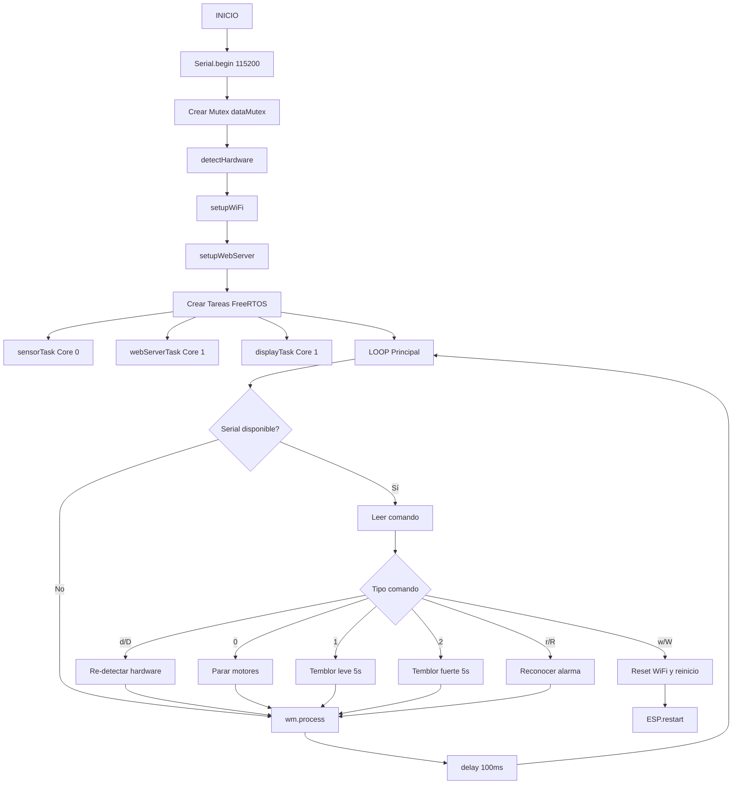
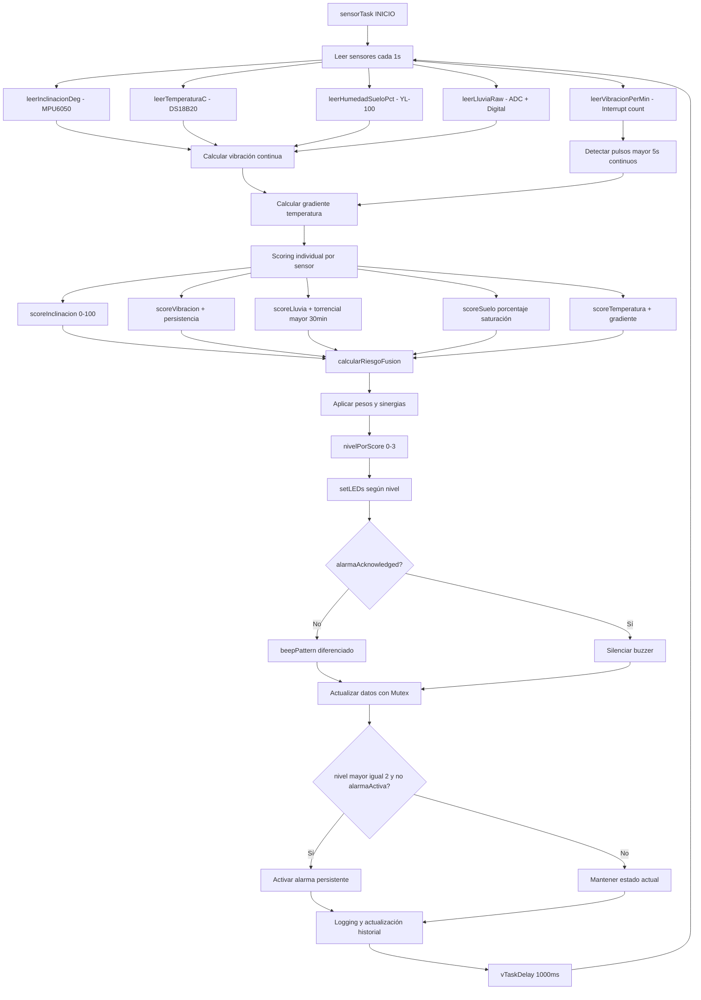
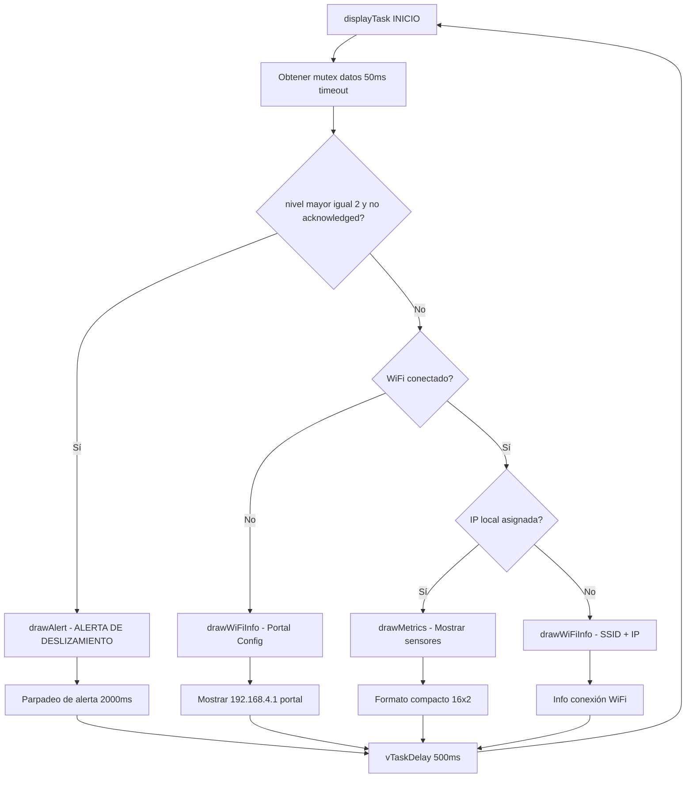
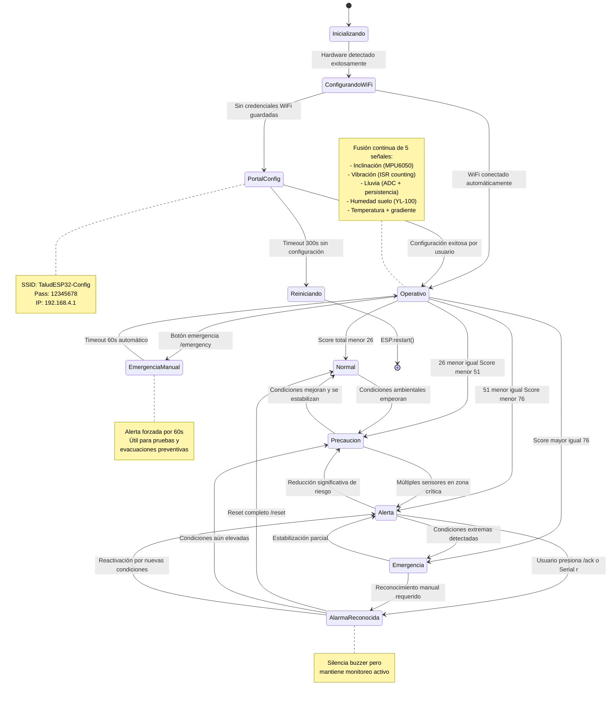
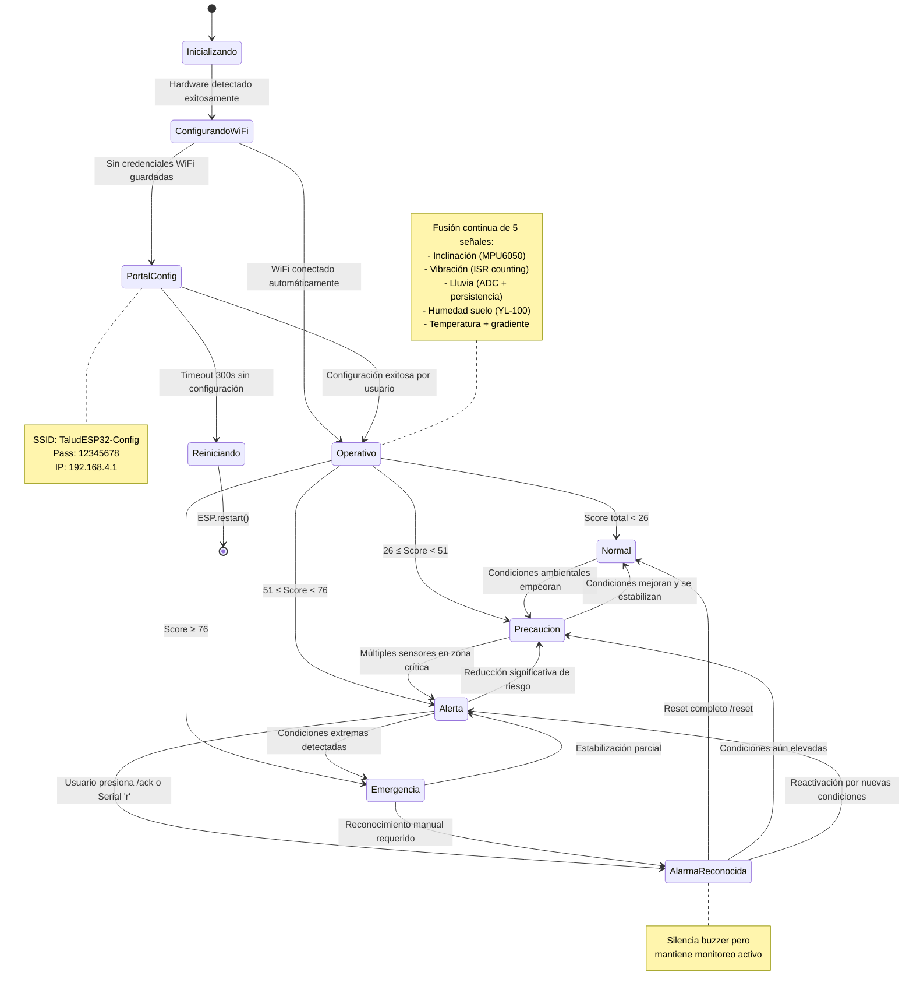

# Sistema de Alerta Temprana de Deslizamientos (Challenge 2)

> Prototipo IoT embebido (ESP32) para monitoreo y alerta temprana de inestabilidad de taludes en Sabana Centro – Cundinamarca. Incluye adquisición concurrente de múltiples variables físicas, lógica de fusión, tablero de control web local y alarmas in situ.

---
## 1. Contexto y Motivación
En mayo de 2025 se presentaron deslizamientos en Tabio y Cajicá (Cundinamarca) que ocasionaron cierre de vías y afectaron a más de 2.200 familias. Este reto busca un sistema de bajo costo, desplegable localmente y que permita a autoridades monitorear indicadores clave de riesgo de inestabilidad: inclinación, vibración, lluvia, humedad del suelo y temperatura.

El enfoque se centra en: (1) medición multi-sensorial continua, (2) procesamiento y fusión local de datos, (3) visualización restringida a la WLAN oficial y (4) alarmas diferenciadas por nivel.

---
## 2. Objetivo General
Desarrollar un prototipo funcional que detecte condiciones precursoras de deslizamientos mediante la combinación de al menos tres señales independientes y provea alertas tanto locales (LEDs, buzzer, LCD) como remotas a través de un tablero de control web embebido accesible únicamente dentro de la red Wi-Fi designada.

---
## 3. Alcance (Challenge 2)
Incluye:
- Configuración dinámica de Wi-Fi con WiFiManager.
- Servidor web embebido (ESP32) con restricciones de acceso a red local (filtro por subred).
- Historización circular de lecturas (buffer de 50 muestras) y entrega en JSON.
- Lógica de fusión con scoring multi-variable y escalado de niveles (0: Normal, 1: Precaución, 2: Alerta, 3: Emergencia).
- Reconocimiento y reinicio de alarmas vía dashboard y comandos Serial.
- Tareas FreeRTOS dedicadas: adquisición, servidor web y visualización.
- Control de alarma física (buzzer + LEDs) y persistencia hasta reconocimiento.

Pendiente para versiones futuras (ejemplos): persistencia prolongada en SPIFFS / SD, refinamiento de gradientes térmicos, agregación de pronósticos, redundancia de sensores.

---
## 4. Requerimientos del Reto (Derivados de `resumen.txt`)
- Microcontrolador permitido: ESP32 / Arduino (No Raspberry Pi).
- Mínimo tres señales independientes para emitir alerta (se integran 5: inclinación, vibración, lluvia, humedad de suelo, temperatura/gradiente).
- Mediciones en hilo distinto / ISR (uso de FreeRTOS + interrupción para vibración).
- Alarma física in situ (buzzer + LEDs) y visualización local (LCD + web UI).
- Tablero de control: servidor web embebido, acceso restringido a la misma WLAN (validación de subred en `handleRoot`).
- Dashboard: valores actuales + historial reciente + control de reconocimiento / reinicio de alarma.
- Prohibido MQTT (no se usa ningún broker, todo HTTP local).

---
## 5. Arquitectura Técnica
### 5.1 Vista de Bloques
Sensores → (Adquisición concurrente) → Normalización / Scoring → Fusión → Nivel de Riesgo → Actuadores + Dashboard Web.

Componentes principales:
- Adquisición: I2C (MPU6050, LCD), OneWire (DS18B20), ADC (lluvia, suelo), GPIO (vibración).
- Procesamiento: cálculo de inclinación, eventos/min vibración, % humedad estimada, intensidad de lluvia (ADC escalado), gradiente térmico.
- Fusión: función de scoring por sensor y agregación ponderada con realce de sinergias de riesgo.
- Notificación: LED por nivel, patrones de buzzer, página HTML dinámica + endpoints JSON (`/data`, `/history`).
- Control: reconocimiento (`/ack`), reinicio (`/reset`) y alerta manual (`/emergency`) de alarma.

### 5.2 Concurrencia (FreeRTOS)
- `sensorTask`: 1 Hz, lee sensores, calcula scores, actualiza estructura compartida protegida por mutex.
- `webServerTask`: atiende peticiones HTTP y reintentos Wi-Fi.
- `displayTask`: refresca LCD y muestra pantallas de alerta priorizándolas.

### 5.3 Seguridad / Restricción de Acceso
`handleRoot()` valida que la IP del cliente pertenezca a la misma subred (mismo /24) que la IP local del ESP32. Accesos externos son respondidos con 403.

### 5.4 Diagramas de Flujo del Sistema

#### 5.4.1 Flujo Principal (Setup y Loop)

Este diagrama ilustra la secuencia de inicialización del sistema desde el encendido hasta la operación concurrente. Muestra la configuración inicial de hardware, WiFi, servidor web y la creación de tareas FreeRTOS distribuidas entre los dos cores del ESP32.



**Características del Flujo Principal:**
- **Inicialización secuencial**: Hardware → WiFi → Servidor Web → Tareas concurrentes
- **Distribución de cores**: sensorTask (Core 0, prioridad 2), webServerTask y displayTask (Core 1, prioridad 1)
- **Comandos interactivos**: Control por Serial para diagnóstico y simulación de eventos
- **Gestión de WiFi**: Proceso continuo de WiFiManager para mantener conectividad

#### 5.4.2 Tarea de Sensores (Core 0) - Adquisición y Procesamiento

La tarea más crítica del sistema, ejecutándose cada segundo en el Core 0 con máxima prioridad. Implementa la fusión de múltiples señales independientes y gestiona el estado de las alarmas según los niveles de riesgo calculados.



**Aspectos Técnicos de la Tarea de Sensores:**
- **Frecuencia crítica**: 1 Hz para balance entre responsividad y estabilidad
- **Fusión multi-sensorial**: 5 señales independientes con pesos calibrados (w_inc=0.35, w_vib=0.25, w_sue=0.20, w_llu=0.15, w_tmp=0.05)
- **Persistencia de eventos**: Detección de lluvia torrencial >30min y vibración continua >5s
- **Gestión de memoria**: Buffer circular de 50 muestras para evitar fragmentación
- **Sincronización**: Mutex para acceso seguro desde múltiples tareas

#### 5.4.3 Tarea de Display (Core 1) - Interfaz Visual Local

Gestiona la presentación visual en pantalla LCD 16x2, priorizando alertas críticas sobre información normal del sistema. Implementa diferentes modos de visualización según el estado operacional.



**Características del Display:**
- **Priorización de alertas**: Las alertas críticas interrumpen cualquier otra visualización
- **Formato compacto**: Optimizado para pantalla LCD 16x2 con información esencial
- **Estados visuales diferenciados**: 
  - Normal: Métricas de sensores (I:inclinación, V:vibración, L:lluvia, H:humedad, T:temperatura)
  - Alerta: Mensaje parpadeante "ALERTA DE DESLIZAMIENTO"
  - WiFi: Estado de conexión o portal de configuración
- **Actualización fluida**: 500ms de período para balance entre responsividad y parpadeo suave

#### 5.4.4 Estados y Transiciones del Sistema

Diagrama de estados que modela el comportamiento completo del sistema desde la inicialización hasta la gestión de alertas, mostrando todas las transiciones posibles y los criterios de cambio entre estados.



**Criterios de Transición entre Estados:**

1. **Estados de Inicialización:**
   - `Inicializando → ConfigurandoWiFi`: Detección exitosa de al menos un sensor crítico
   - `ConfigurandoWiFi → PortalConfig`: No hay credenciales almacenadas o fallo de conexión
   - `ConfigurandoWiFi → Operativo`: Conexión automática exitosa a red conocida

2. **Estados Operacionales (basados en Score de Fusión):**
   - `Normal (0-25)`: Condiciones estables, todos los sensores en rangos seguros
   - `Precaución (26-50)`: Uno o más sensores muestran valores elevados pero no críticos
   - `Alerta (51-75)`: Múltiples indicadores críticos o sinergias detectadas
   - `Emergencia (76-100)`: Condiciones extremas que requieren evacuación inmediata

3. **Gestión de Alarmas:**
   - Niveles ≥2 (Alerta/Emergencia) activan alarma física persistente
   - Reconocimiento silencia buzzer pero mantiene monitoreo
   - Reset completo restaura estado normal si condiciones lo permiten
   - **Nueva funcionalidad**: Emergencia manual desde dashboard web (60s de duración)

4. **Recuperación y Robustez:**
   - Timeout del portal WiFi provoca reinicio automático
   - Pérdida de conectividad mantiene operación local
   - Estados pueden revertir automáticamente si condiciones mejoran

**Indicadores Visuales por Estado:**
- Normal: LED Verde + métricas en LCD
- Precaución: LED Amarillo + beep ocasional (3s)
- Alerta: LED Naranja + beep doble (650ms) + mensaje LCD parpadeante
- Emergencia: LED Rojo + beep continuo (300ms) + alerta visual persistente
- **Emergencia Manual**: LED Rojo + beep continuo + mensaje "EMERGENCIA MANUAL" en LCD

---
## 6. Sensores y Umbrales (Resumen)
| Variable | Sensor | Parámetro Derivado | Estados Base (ejemplo) |
|----------|--------|--------------------|------------------------|
| Vibración | Interruptor / switch | Activaciones por minuto y continuidad | 0–2 Normal, 3–5 Precaución, >5 o continua >5s Alerta/Emergencia |
| Lluvia | Módulo analógico (ADC 0–4095) | Intensidad (ADC) | <800 Normal, 800–2400 Precaución, >2400 Torrencial |
| Humedad suelo | YL-100 | % estimado (map desde RAW seco/saturado) | 0–40 Normal, 40–70 Precaución, >70 Saturado |
| Temperatura | DS18B20 | °C + gradiente °C/min | 10–30 estable Normal; <10 o grad>2 Precaución; <5 o grad>5 Alerta |
| Inclinación | MPU6050 | Grados | <2 estable; 2–5 Precaución; >5 Alerta |

---
## 7. Lógica de Fusión (Simplificada)
1. Cada sensor produce un score 0–100 según umbrales.
2. Pesos relativos (ejemplo operativo: inclinación y vibración con mayor influencia si ambos altos).
3. Sinergias elevan score (p.ej. vibración + saturación + lluvia fuerte).
4. Mapeo final:
   - Score < 25 => Nivel 0
   - 25–49 => Nivel 1
   - 50–74 => Nivel 2
   - ≥75 => Nivel 3
5. Activación de alarma física si nivel ≥ 2 (no se silencia hasta reconocimiento).

---
## 8. Endpoints del Tablero Web
| Ruta | Método | Descripción | Restricción |
|------|--------|------------|-------------|
| `/` | GET | Dashboard HTML dinámico | Misma subred local |
| `/data` | GET | Lectura actual (JSON) | Local |
| `/history` | GET | Historial circular (JSON) | Local |
| `/ack` | POST | Reconocer (silencia buzzer) | Local |
| `/reset` | POST | Reiniciar estado de alarma | Local |
| `/emergency` | POST | Activar alerta manual 60s | Local |

Ejemplo de respuesta `/data` (fragmento):
```json
{
  "inclinacion": 1.8,
  "vibracion": 2.0,
  "temperatura": 24.6,
  "humedad_suelo": 55.2,
  "lluvia": 1200,
  "score": 48.7,
  "nivel": 1,
  "alarma_activa": false,
  "emergencia_manual": false,
  "timestamp": 1234567
}
```

**Funcionalidad de Emergencia Manual:**
- Endpoint `/emergency` activa una alerta de emergencia por 60 segundos
- Útil para evacuaciones preventivas o pruebas del sistema
- Activa LED rojo, buzzer continuo y mensaje en LCD "EMERGENCIA MANUAL"
- Se desactiva automáticamente tras 60 segundos o con `/reset`
- Tiene prioridad sobre alertas automáticas del sistema

---
## 9. Flujo de Operación
1. Encendido → Autodiagnóstico: escaneo I2C, sensores, heurística ADC.
2. Portal WiFiManager (si no hay credenciales) → asociación WLAN municipal.
3. Inicia tareas y servidor web.
4. Adquisición periódica y actualización de buffer histórico.
5. Fusión → Nivel → Actuadores / Dashboard.
6. Si Nivel ≥ 2: activar alarma hasta `ack` o `reset`.

---
## 10. Hardware (Pines Clave)
| Función | Pin ESP32 |
|---------|-----------|
| I2C SDA / SCL | 21 / 22 |
| Vibración | 34 |
| Lluvia A0 / D0 | 36 / 4 |
| Humedad suelo (YL-100) | 39 |
| DS18B20 | 5 |
| LEDs (Verde/Amarillo/Naranja/Rojo) | 13 / 12 / 14 / 27 |
| Buzzer | 25 |
| Motores AIN1/AIN2/PWMA | 33 / 32 / 18 |
| Motores BIN1/BIN2/PWMB | 19 / 23 / 26 |

Notas: usar puente H (TB6612 / L298N) y fuente externa para motores; GND común.

---
## 11. Comandos por Serial
| Comando | Acción |
|---------|--------|
| `d` | Re-detectar hardware |
| `0` | Detener motores |
| `1` | Simular temblor leve (5 s) |
| `2` | Simular temblor fuerte (5 s) |
| `r` | Reconocer alarma |
| `w` | Reset credenciales Wi-Fi y reinicio |

Baudios: 115200.

---
## 12. Estrategias de Calidad y Robustez
- Mutex (`SemaphoreHandle_t`) para proteger estructura compartida `currentData`.
- Ventanas temporales para cálculo de vibración y gradiente térmico.
- Historial circular para evitar saturación de memoria.
- Validación de subred para restringir acceso (no se expone exteriormente / sin MQTT).
- ISR para vibración (conteo de pulsos con anti-rebote temporal ligero en implementación omitida).
- Detección de sensores ausentes: devuelve `NAN` y el scoring los penaliza según diseño.

---
## 13. Limitaciones Conocidas
- No hay persistencia larga (reinicio pierde historial >50 muestras).
- Filtro de inclinación básico (se puede añadir promediado / filtro complementario).
- No se implementa autenticación adicional (solo restricción por red local).
- Gradiente térmico calculado con diferencias sucesivas (sin suavizado exponencial todavía).

---
## 14. Próximos Pasos (Trabajo Futuro)
- Persistencia en SPIFFS/SD y exportación CSV.
- Autenticación ligera (token local / basic auth opcional).
- Ajuste adaptativo de umbrales con datos históricos.
- Correlación lluvia-acumulada y humedad para predicción mejorada.
- Integración de módulo de energía (batería + monitoreo de voltaje) y modo ahorro.

---
## 15. Licencia y Uso Académico
Proyecto académico para la asignatura de Internet de las Cosas – Universidad de La Sabana. Uso educativo; ajustar antes de despliegues reales en campo.

---
## 16. Referencias (Selección)
- Bhardwaj (2021) – Análisis de vibraciones y sistemas de alerta temprana.
- El Moulat et al. (2018) – Arquitecturas IoT para monitoreo ambiental.
- Henao-Céspedes et al. (2023) – Indicadores multivariables de estabilidad de laderas.
- Piciullo et al. (2022) – Sistemas locales de alerta temprana para deslizamientos.
- Soegoto et al. (2021) – Factores meteorológicos y riesgo geotécnico.

(Referencias completas a desarrollar en la Wiki según formato institucional.)

---
## 17. Cómo Probar Rápido
1. Cargar `code/challenge2.ino` al ESP32 (Arduino IDE / PlatformIO). 
2. Abrir monitor serie (115200) y esperar mensaje de portal o IP asignada. 
3. Si aparece portal: conectarse a red `TaludESP32-Config` (pass: `12345678`), configurar WLAN oficial. 
4. Una vez conectado: navegar a `http://<IP_ESP32>` en la misma red. 
5. Generar eventos: tocar sensor lluvia (agua), mover módulo vibración, inclinar placa, humedecer suelo. 
6. Observar cambio de nivel, LED y patrón de buzzer. Reconocer alarma desde dashboard o Serial (`r`).

---
## 19. Créditos
Equipo de desarrollo – Curso IoT 2025-2, Universidad de La Sabana.

---
## 20. Estado Actual
Versión preliminar alineada con requisitos de Challenge 2. Lista para continuar con documentación Wiki, pruebas formales y refinamiento de calibraciones.

### 21.2 Tarea de Sensores (Core 0) - Adquisición y Procesamiento

La tarea más crítica del sistema, ejecutándose cada segundo en el Core 0 con máxima prioridad. Implementa la fusión de múltiples señales independientes y gestiona el estado de las alarmas según los niveles de riesgo calculados.

```mermaid
flowchart TD
    A[sensorTask INICIO] --> B[Leer sensores cada 1s]
    B --> C[leerInclinacionDeg - MPU6050]
    B --> D[leerVibracionPerMin - Interrupt count]
    B --> E[leerTemperaturaC - DS18B20]
    B --> F[leerHumedadSueloPct - YL-100]
    B --> G[leerLluviaRaw - ADC + Digital]
    
    C --> H[Calcular vibración continua]
    D --> H[Detectar pulsos >5s continuos]
    E --> H
    F --> H
    G --> H
    
    H --> I[Calcular gradiente temperatura °C/min]
    I --> J[Scoring individual por sensor]
    J --> K[scoreInclinacion 0-100]
    J --> L[scoreVibracion + persistencia]
    J --> M[scoreLluvia + torrencial >30min]
    J --> N[scoreSuelo % saturación]
    J --> O[scoreTemperatura + gradiente]
    
    K --> P[calcularRiesgoFusion]
    L --> P[Aplicar pesos y sinergias]
    M --> P[w_inc=0.35, w_vib=0.25, w_sue=0.20]
    N --> P[w_llu=0.15, w_tmp=0.05]
    O --> P
    
    P --> Q[nivelPorScore 0-3]
    Q --> R[setLEDs según nivel]
    R --> S{alarmaAcknowledged?}
    S -->|No| T[beepPattern diferenciado]
    S -->|Sí| U[Silenciar buzzer]
    
    T --> V[Actualizar datos con Mutex]
    U --> V[Protección concurrente]
    V --> W{nivel >= 2 && !alarmaActiva?}
    W -->|Sí| X[Activar alarma persistente]
    W -->|No| Y[Mantener estado actual]
    
    X --> Z[Logging y actualización historial]
    Y --> Z[Cada 30s buffer circular[50]]
    Z --> AA[vTaskDelay 1000ms]
    AA --> B
```

**Aspectos Técnicos de la Tarea de Sensores:**
- **Frecuencia crítica**: 1 Hz para balance entre responsividad y estabilidad
- **Fusión multi-sensorial**: 5 señales independientes con pesos calibrados
- **Persistencia de eventos**: Detección de lluvia torrencial >30min y vibración continua >5s
- **Gestión de memoria**: Buffer circular de 50 muestras para evitar fragmentación
- **Sincronización**: Mutex para acceso seguro desde múltiples tareas

### 21.3 Tarea de Display (Core 1) - Interfaz Visual Local

Gestiona la presentación visual en pantalla LCD 16x2, priorizando alertas críticas sobre información normal del sistema. Implementa diferentes modos de visualización según el estado operacional.


**Características del Display:**
- **Priorización de alertas**: Las alertas críticas interrumpen cualquier otra visualización
- **Formato compacto**: Optimizado para pantalla LCD 16x2 con información esencial
- **Estados visuales diferenciados**: 
  - Normal: Métricas de sensores (I:inclinación, V:vibración, L:lluvia, H:humedad, T:temperatura)
  - Alerta: Mensaje parpadeante "ALERTA DE DESLIZAMIENTO"
  - WiFi: Estado de conexión o portal de configuración
- **Actualización fluida**: 500ms de período para balance entre responsividad y parpadeo suave

### 21.4 Estados y Transiciones del Sistema

Diagrama de estados que modela el comportamiento completo del sistema desde la inicialización hasta la gestión de alertas, mostrando todas las transiciones posibles y los criterios de cambio entre estados.



**Criterios de Transición entre Estados:**

1. **Estados de Inicialización:**
   - `Inicializando → ConfigurandoWiFi`: Detección exitosa de al menos un sensor crítico
   - `ConfigurandoWiFi → PortalConfig`: No hay credenciales almacenadas o fallo de conexión
   - `ConfigurandoWiFi → Operativo`: Conexión automática exitosa a red conocida

2. **Estados Operacionales (basados en Score de Fusión):**
   - `Normal (0-25)`: Condiciones estables, todos los sensores en rangos seguros
   - `Precaución (26-50)`: Uno o más sensores muestran valores elevados pero no críticos
   - `Alerta (51-75)`: Múltiples indicadores críticos o sinergias detectadas
   - `Emergencia (76-100)`: Condiciones extremas que requieren evacuación inmediata

3. **Gestión de Alarmas:**
   - Niveles ≥2 (Alerta/Emergencia) activan alarma física persistente
   - Reconocimiento silencia buzzer pero mantiene monitoreo
   - Reset completo restaura estado normal si condiciones lo permiten

4. **Recuperación y Robustez:**
   - Timeout del portal WiFi provoca reinicio automático
   - Pérdida de conectividad mantiene operación local
   - Estados pueden revertir automáticamente si condiciones mejoran

**Indicadores Visuales por Estado:**
- Normal: LED Verde + métricas en LCD
- Precaución: LED Amarillo + beep ocasional (3s)
- Alerta: LED Naranja + beep doble (650ms) + mensaje LCD parpadeante
- Emergencia: LED Rojo + beep continuo (300ms) + alerta visual persistente
