# Sistema de Alerta Temprana de Deslizamientos (Challenge 2)

> Prototipo IoT embebido (ESP32) para monitoreo y alerta temprana de inestabilidad de taludes en Sabana Centro – Cundinamarca. Incluye adquisición concurrente de múltiples variables físicas, lógica de fusión, tablero de control web local y alarmas in situ.

---
## 1. Contexto y Motivación
En mayo de 2025 se presentaron deslizamientos en Tabio y Cajicá (Cundinamarca) que ocasionaron cierre de vías y afectaron a más de 2.200 familias. Este reto busca un sistema de bajo costo, desplegable localmente y que permita a autoridades monitorear indicadores clave de riesgo de inestabilidad: inclinación, vibración, lluvia, humedad del suelo y temperatura.

El enfoque se centra en: (1) medición multi-sensorial continua, (2) procesamiento y fusión local de datos, (3) visualización restringida a la WLAN oficial y (4) alarmas diferenciadas por nivel.

---
## 2. Objetivo General
Desarrollar un prototipo funcional que detecte condiciones precursoras de deslizamientos mediante la combinación de al menos cinco señales independientes y provea alertas tanto locales (LEDs, buzzer, LCD) como remotas a través de un tablero de control web embebido accesible únicamente dentro de la red Wi-Fi designada.

---
## 3. Alcance (Challenge 2)
Incluye:
- Configuración dinámica de Wi-Fi con WiFiManager.
- Servidor web embebido (ESP32).
- Lógica de fusión con scoring multi-variable y escalado de niveles (0: Normal, 1: Precaución, 2: Alerta, 3: Emergencia).
- Reconocimiento y reinicio de alarmas vía dashboard y comandos Serial.
- Tareas FreeRTOS dedicadas: adquisición, servidor web y visualización.
- Control de alarma física (buzzer + LEDs) y persistencia hasta reconocimiento.


---
## 4. Arquitectura Técnica
### 4.1 Vista de Bloques

#### 4.1.1 Diagrama de Arquitectura del Sistema

```mermaid
C4Component
    title Sistema de Alerta Temprana de Deslizamientos - Vista de Componentes

    Container_Boundary(esp32, "ESP32 Dual-Core") {
        Component(sensorLayer, "Sensor Layer", "Hardware Abstraction", "Interfaz unificada para acceso a sensores heterogéneos")
        Component(acqManager, "Acquisition Manager", "FreeRTOS Task", "Orquestación de lectura concurrente multi-sensor")
        Component(dataProcessor, "Signal Processor", "Core Processing", "Normalización, filtrado y cálculo de métricas derivadas")
        Component(fusionEngine, "Fusion Engine", "Decision Logic", "Algoritmo de scoring ponderado con detección de sinergias")
        Component(alarmController, "Alarm Controller", "State Machine", "Gestión de estados de alarma y persistencia")
        Component(webServer, "Web Server", "HTTP/JSON API", "Servidor embebido con endpoints REST")
        Component(displayManager, "Display Manager", "UI Controller", "Control de interfaces visuales locales")
        Component(dataBuffer, "Data Buffer", "Circular Buffer", "Almacenamiento temporal thread-safe")
    }

    Container_Boundary(sensors, "Sensor Subsystems") {
        Component(mpu6050, "MPU6050", "I2C Sensor", "Acelerómetro/Giroscopio 3-axis")
        Component(ds18b20, "DS18B20", "OneWire Sensor", "Sensor de temperatura digital")
        Component(vibSensor, "Vibration Sensor", "GPIO/ISR", "Detector de vibración con anti-rebote")
        Component(rainSensor, "Rain Sensor", "ADC/Digital", "Módulo de lluvia analógico + digital")
        Component(soilSensor, "YL-100", "ADC", "Sensor de humedad del suelo")
    }

    Container_Boundary(actuators, "Actuator Subsystems") {
        Component(ledArray, "LED Array", "GPIO Output", "Indicadores visuales por nivel de riesgo")
        Component(buzzer, "Buzzer", "PWM Output", "Alarmas sonoras diferenciadas")
        Component(lcd, "LCD 16x2", "I2C Display", "Pantalla de información local")
        Component(motorDriver, "Motor Driver", "H-Bridge", "Simulador de eventos sísmicos")
    }

    Container_Boundary(network, "Network Layer") {
        Component(wifiManager, "WiFi Manager", "Connection Manager", "Gestión automática de conectividad")
        Component(accessControl, "Access Control", "Security Layer", "Validación de subred local")
    }

    Container_Boundary(external, "External Interfaces") {
        Component(dashboard, "Web Dashboard", "HTML5/JS", "Interfaz de usuario web responsiva")
        Component(serialInterface, "Serial Interface", "UART", "Comandos de diagnóstico y control")
    }

    %% Sensor Layer Relationships
    Rel(mpu6050, sensorLayer, "I2C", "0x68")
    Rel(ds18b20, sensorLayer, "OneWire", "Pin 5")
    Rel(vibSensor, sensorLayer, "GPIO/ISR", "Pin 34")
    Rel(rainSensor, sensorLayer, "ADC", "Pin 36/4")
    Rel(soilSensor, sensorLayer, "ADC", "Pin 39")

    %% Processing Chain
    Rel(sensorLayer, acqManager, "read()", "1Hz polling")
    Rel(acqManager, dataProcessor, "rawData[]", "Async")
    Rel(dataProcessor, fusionEngine, "metrics{}", "Normalized")
    Rel(fusionEngine, alarmController, "riskLevel", "0-3 scale")

    %% Data Flow
    Rel(dataProcessor, dataBuffer, "store()", "Thread-safe")
    Rel(dataBuffer, webServer, "getData()", "JSON format")
    Rel(alarmController, ledArray, "setLevel()", "PWM/GPIO")
    Rel(alarmController, buzzer, "playPattern()", "Frequency/Duration")
    Rel(acqManager, displayManager, "currentState", "Mutex protected")
    Rel(displayManager, lcd, "display()", "I2C commands")

    %% Network Communications
    Rel(webServer, wifiManager, "isConnected()", "Status check")
    Rel(webServer, accessControl, "validateIP()", "Security")
    Rel(dashboard, webServer, "HTTP/REST", "GET/POST")
    Rel(serialInterface, alarmController, "commands", "Debug/Control")

    %% Actuator Control
    Rel(alarmController, motorDriver, "simulate()", "Test events")

    UpdateLayoutConfig($c4ShapeInRow="3", $c4BoundaryInRow="2")
```



#### 4.1.2 Diagrama de Componentes Detallado

```mermaid
classDiagram
    %% Sensor Interface Layer
    class SensorInterface {
        <<interface>>
        +readValue() float
        +isConnected() bool
        +getLastError() String
        +calibrate() void
    }

    class MPU6050Sensor {
        -address: 0x68
        -accelScale: ±2g
        -gyroScale: ±250°/s
        +readAcceleration() Vector3D
        +readGyroscope() Vector3D
        +calculateInclination() float
        +selfTest() bool
    }

    class DS18B20Sensor {
        -pin: GPIO5
        -resolution: 12-bit
        -conversionTime: 750ms
        +requestTemperature() void
        +readTemperatureC() float
        +getDeviceAddress() uint64_t
    }

    class VibrationSensor {
        -pin: GPIO34
        -isrCounter: volatile uint32_t
        -lastTrigger: unsigned long
        -debounceTime: 50ms
        +attachInterrupt() void
        +getEventsPerMinute() uint16_t
        +isContinuous() bool
        +resetCounter() void
    }

    %% Data Processing Layer
    class DataProcessor {
        -filterWindow: 5
        -temperatureHistory: float[10]
        -vibrationBuffer: uint16_t[60]
        +normalizeInclination(raw: float) float
        +calculateTempGradient() float
        +detectVibrPattern() bool
        +estimateSoilMoisture(adc: int) float
        +classifyRainIntensity(adc: int) RainLevel
    }

    class FusionEngine {
        -weights: {inc: 0.35, vib: 0.25, soil: 0.20, rain: 0.15, temp: 0.05}
        -synergyMatrix: float[5][5]
        -persistenceThresholds: {rain: 30min, vib: 5s}
        +calculateScore(metrics: SensorMetrics) float
        +detectSynergies(scores: ScoreVector) float
        +mapToRiskLevel(totalScore: float) uint8_t
        +applyPersistence(currentScore: float, history: TimeWindow) float
    }

    %% State Management
    class AlarmStateMachine {
        <<enumeration>> AlarmState
        NORMAL
        PRECAUCION
        ALERTA
        EMERGENCIA
        ACKNOWLEDGED
        MANUAL_EMERGENCY
        
        -currentState: AlarmState
        -acknowledgedTime: unsigned long
        -alarmStartTime: unsigned long
        -emergencyTimeout: 60s
        
        +transition(newLevel: uint8_t) void
        +acknowledge() bool
        +reset() void
        +triggerManualEmergency() void
        +isAlarmActive() bool
    }

    %% Communication Layer
    class WebServerController {
        -server: AsyncWebServer
        -accessControl: NetworkSecurity
        -jsonBufferSize: 2048
        +handleRoot() void
        +handleDataAPI() void
        +handleHistoryAPI() void
        +handleAcknowledge() void
        +handleReset() void
        +handleEmergency() void
        +validateClientIP(clientIP: IPAddress) bool
    }

    class DataBuffer {
        -buffer: SensorData[50]
        -writeIndex: uint8_t
        -isFull: bool
        -mutex: SemaphoreHandle_t
        +store(data: SensorData) void
        +getLatest() SensorData
        +getHistory(count: uint8_t) SensorData[]
        +clear() void
    }

    %% Hardware Abstraction
    class ActuatorController {
        -ledPins: {green: 13, yellow: 12, orange: 14, red: 27}
        -buzzerPin: 25
        -buzzerFrequencies: {normal: 0, precaution: 1000, alert: 1500, emergency: 2000}
        +setLEDState(level: uint8_t) void
        +playBuzzerPattern(level: uint8_t) void
        +stopAlarm() void
    }

    class DisplayController {
        -lcd: LiquidCrystal_I2C
        -currentMode: DisplayMode
        -alertBlinkState: bool
        -lastUpdate: unsigned long
        +drawMetrics(data: SensorData) void
        +drawAlert(level: uint8_t) void
        +drawWiFiInfo(status: WiFiStatus) void
        +blinkAlert() void
    }

    %% Relationships
    SensorInterface <|.. MPU6050Sensor
    SensorInterface <|.. DS18B20Sensor
    SensorInterface <|.. VibrationSensor

    DataProcessor --> SensorInterface : uses
    FusionEngine --> DataProcessor : processes
    AlarmStateMachine --> FusionEngine : receives risk level
    ActuatorController --> AlarmStateMachine : observes state
    DisplayController --> AlarmStateMachine : observes state
    WebServerController --> DataBuffer : queries data
    DataBuffer --> DataProcessor : stores processed data

    %% Composition relationships
    WebServerController *-- NetworkSecurity
    AlarmStateMachine *-- AlarmState
    DataProcessor *-- FilteringAlgorithms
    FusionEngine *-- SynergyDetector
```

#### 4.1.3 Vista de Despliegue y Distribución de Tareas

```mermaid
deploymentDiagram
    
    node "ESP32 Dual-Core MCU" {
        
        node "Core 0 (Protocol CPU)" {
            component "sensorTask" {
                [Sensor Reading Manager]
                [Data Processing Pipeline]
                [Fusion Engine]
                [Alarm State Machine]
                
                note "Priority: 2 (High)\nStack: 4096 bytes\nFrequency: 1Hz\nWatchdog: Enabled"
            }
        }
        
        node "Core 1 (Application CPU)" {
            component "webServerTask" {
                [HTTP Request Handler]
                [JSON Response Generator]
                [WiFi Connection Manager]
                [Access Control Validator]
                
                note "Priority: 1 (Normal)\nStack: 8192 bytes\nAsync: Event-driven\nWatchdog: Enabled"
            }
            
            component "displayTask" {
                [LCD Controller]
                [Alert Renderer]
                [Status Display Manager]
                [Blink Animation Controller]
                
                note "Priority: 1 (Normal)\nStack: 2048 bytes\nFrequency: 2Hz\nNon-blocking UI"
            }
        }
        
        node "Hardware Peripherals" {
            component "I2C Bus (Pins 21/22)" {
                [MPU6050 - 0x68]
                [LCD Display - 0x27]
            }
            
            component "OneWire Bus (Pin 5)" {
                [DS18B20 Temperature]
            }
            
            component "ADC Channels" {
                [Rain Sensor - Pin 36]
                [Soil Moisture - Pin 39]
            }
            
            component "GPIO Interfaces" {
                [Vibration ISR - Pin 34]
                [LED Array - Pins 13,12,14,27]
                [Buzzer PWM - Pin 25]
                [Motor Driver - Pins 18,19,23,26,32,33]
            }
        }
        
        node "Memory Management" {
            component "SRAM Allocation" {
                [Data Buffer: 2KB]
                [JSON Buffer: 2KB]
                [Task Stacks: 14KB]
                [Sensor Cache: 1KB]
                [Free Heap: ~280KB]
            }
            
            component "Flash Storage" {
                [Program Code: ~1.2MB]
                [WiFi Credentials: NVS]
                [HTML Assets: 8KB]
                [Calibration Data: 512B]
            }
        }
    }
    
    node "Network Infrastructure" {
        component "WiFi Access Point" {
            [Municipal WLAN]
            [Configuration Portal]
            
            note "SSID: TaludESP32-Config\nSecurity: WPA2-PSK\nIP Range: 192.168.4.0/24"
        }
    }
    
    node "Client Devices" {
        component "Emergency Dashboard" {
            [Web Browser Interface]
            [Real-time Data Display]
            [Control Panel]
            [Alert Management]
            
            note "Technologies: HTML5, CSS3, JavaScript\nUpdate Rate: 2 seconds\nMobile Responsive: Yes"
        }
        
        component "Serial Console" {
            [Debug Interface]
            [Command Line Control]
            [System Diagnostics]
            
            note "Baud Rate: 115200\nProtocol: ASCII Commands\nBuffer: 256 bytes"
        }
    }
    
    %% Connections
    "sensorTask" --> "Hardware Peripherals" : Direct Hardware Access
    "webServerTask" --> "Network Infrastructure" : HTTP/TCP
    "displayTask" --> "I2C Bus (Pins 21/22)" : Display Commands
    "Emergency Dashboard" --> "webServerTask" : REST API Calls
    "Serial Console" --> "sensorTask" : Command Processing
    "Data Buffer" --> "Memory Management" : Thread-Safe Storage
```

**Componentes principales:**
- **Adquisición**: I2C (MPU6050, LCD), OneWire (DS18B20), ADC (lluvia, suelo), GPIO (vibración).
- **Procesamiento**: cálculo de inclinación, eventos/min vibración, % humedad estimada, intensidad de lluvia (ADC escalado), gradiente térmico.
- **Fusión**: función de scoring por sensor y agregación ponderada con realce de sinergias de riesgo.
- **Notificación**: LED por nivel, patrones de buzzer, página HTML dinámica + endpoints JSON (`/data`, `/history`).
- **Control**: reconocimiento (`/ack`), reinicio (`/reset`) y alerta manual (`/emergency`) de alarma.

### 4.2 Concurrencia (FreeRTOS)
- `sensorTask`: 1 Hz, lee sensores, calcula scores, actualiza estructura compartida protegida por mutex.
- `webServerTask`: atiende peticiones HTTP y reintentos Wi-Fi.
- `displayTask`: refresca LCD y muestra pantallas de alerta priorizándolas.

### 4.3 Seguridad / Restricción de Acceso
`handleRoot()` valida que la IP del cliente pertenezca a la misma subred (mismo /24) que la IP local del ESP32. Accesos externos son respondidos con 403.

### 4.4 Diagramas de Flujo del Sistema

#### 4.4.1 Flujo Principal (Setup y Loop)

Este diagrama ilustra la secuencia de inicialización del sistema desde el encendido hasta la operación concurrente. Muestra la configuración inicial de hardware, WiFi, servidor web y la creación de tareas FreeRTOS distribuidas entre los dos cores del ESP32.


**Características del Flujo Principal:**
- **Inicialización secuencial**: Hardware → WiFi → Servidor Web → Tareas concurrentes
- **Distribución de cores**: sensorTask (Core 0, prioridad 2), webServerTask y displayTask (Core 1, prioridad 1)
- **Comandos interactivos**: Control por Serial para diagnóstico y simulación de eventos
- **Gestión de WiFi**: Proceso continuo de WiFiManager para mantener conectividad

#### 4.4.2 Tarea de Sensores (Core 0) - Adquisición y Procesamiento

La tarea más crítica del sistema, ejecutándose cada segundo en el Core 0 con máxima prioridad. Implementa la fusión de múltiples señales independientes y gestiona el estado de las alarmas según los niveles de riesgo calculados.


**Aspectos Técnicos de la Tarea de Sensores:**
- **Frecuencia crítica**: 1 Hz para balance entre responsividad y estabilidad
- **Fusión multi-sensorial**: 5 señales independientes con pesos calibrados (w_inc=0.35, w_vib=0.25, w_sue=0.20, w_llu=0.15, w_tmp=0.05)
- **Persistencia de eventos**: Detección de lluvia torrencial >30min y vibración continua >5s
- **Gestión de memoria**: Buffer circular de 50 muestras para evitar fragmentación
- **Sincronización**: Mutex para acceso seguro desde múltiples tareas

#### 4.4.3 Tarea de Display (Core 1) - Interfaz Visual Local

Gestiona la presentación visual en pantalla LCD 16x2, priorizando alertas críticas sobre información normal del sistema. Implementa diferentes modos de visualización según el estado operacional.


**Características del Display:**
- **Priorización de alertas**: Las alertas críticas interrumpen cualquier otra visualización
- **Formato compacto**: Optimizado para pantalla LCD 16x2 con información esencial
- **Estados visuales diferenciados**: 
  - Normal: Métricas de sensores (I:inclinación, V:vibración, L:lluvia, H:humedad, T:temperatura)
  - Alerta: Mensaje parpadeante "ALERTA DE DESLIZAMIENTO"
  - WiFi: Estado de conexión o portal de configuración
- **Actualización fluida**: 500ms de período para balance entre responsividad y parpadeo suave

#### 4.4.4 Estados y Transiciones del Sistema

Diagrama de estados que modela el comportamiento completo del sistema desde la inicialización hasta la gestión de alertas, mostrando todas las transiciones posibles y los criterios de cambio entre estados.


**Criterios de Transición entre Estados:**

1. **Estados de Inicialización:**
   - `Inicializando → ConfigurandoWiFi`: Detección exitosa de al menos un sensor crítico
   - `ConfigurandoWiFi → PortalConfig`: No hay credenciales almacenadas o fallo de conexión
   - `ConfigurandoWiFi → Operativo`: Conexión automática exitosa a red conocida

2. **Estados Operacionales (basados en Score de Fusión):**
   - `Normal (0-25)`: Condiciones estables, todos los sensores en rangos seguros
   - `Precaución (26-50)`: Uno o más sensores muestran valores elevados pero no críticos
   - `Alerta (51-75)`: Múltiples indicadores críticos o sinergias detectadas
   - `Emergencia (76-100)`: Condiciones extremas que requieren evacuación inmediata

3. **Gestión de Alarmas:**
   - Niveles ≥2 (Alerta/Emergencia) activan alarma física persistente
   - Reconocimiento silencia buzzer pero mantiene monitoreo
   - Reset completo restaura estado normal si condiciones lo permiten
   - **Nueva funcionalidad**: Emergencia manual desde dashboard web (60s de duración)

4. **Recuperación y Robustez:**
   - Timeout del portal WiFi provoca reinicio automático
   - Pérdida de conectividad mantiene operación local
   - Estados pueden revertir automáticamente si condiciones mejoran

**Indicadores Visuales por Estado:**
- Normal: LED Verde + métricas en LCD
- Precaución: LED Amarillo + beep ocasional (3s)
- Alerta: LED Naranja + beep doble (650ms) + mensaje LCD parpadeante
- Emergencia: LED Rojo + beep continuo (300ms) + alerta visual persistente
- **Emergencia Manual**: LED Rojo + beep continuo + mensaje "EMERGENCIA MANUAL" en LCD

---
## 5. Sensores y Umbrales (Resumen)
| Variable | Sensor | Parámetro Derivado | Estados Base (ejemplo) |
|----------|--------|--------------------|------------------------|
| Vibración | Interruptor / switch | Activaciones por minuto y continuidad | 0–2 Normal, 3–5 Precaución, >5 o continua >5s Alerta/Emergencia |
| Lluvia | Módulo analógico (ADC 0–4095) | Intensidad (ADC) | <800 Normal, 800–2400 Precaución, >2400 Torrencial |
| Humedad suelo | YL-100 | % estimado (map desde RAW seco/saturado) | 0–40 Normal, 40–70 Precaución, >70 Saturado |
| Temperatura | DS18B20 | °C + gradiente °C/min | 10–30 estable Normal; <10 o grad>2 Precaución; <5 o grad>5 Alerta |
| Inclinación | MPU6050 | Grados | <2 estable; 2–5 Precaución; >5 Alerta |

---
## 6. Lógica de Fusión (Simplificada)
1. Cada sensor produce un score 0–100 según umbrales.
2. Pesos relativos (ejemplo operativo: inclinación y vibración con mayor influencia si ambos altos).
3. Sinergias elevan score (p.ej. vibración + saturación + lluvia fuerte).
4. Mapeo final:
   - Score < 25 => Nivel 0
   - 25–49 => Nivel 1
   - 50–74 => Nivel 2
   - ≥75 => Nivel 3
5. Activación de alarma física si nivel ≥ 2 (no se silencia hasta reconocimiento).

### 6.1 Implementación Técnica de la Lógica de Fusión

#### 6.1.1 Funciones de Scoring Individual por Sensor

Cada sensor mapea sus valores físicos a un score normalizado de 0-100 usando funciones de escalado no lineal que reflejan la criticidad real de cada rango:

```cpp
// ==================== Scoring conforme a umbrales ====================
// Mapea cada sensor a score 0..100 segun los umbrales dados

float scoreInclinacion(float inc) {
  if(isnan(inc)) return 0.0f;
  if(inc >= INC_ALERTA_MIN) return 100.0f;  // ≥5° = Crítico
  if(inc >= INC_PRECAU_MIN) return 60.0f + (inc - INC_PRECAU_MIN) * 
                                   (40.0f / (INC_ALERTA_MIN - INC_PRECAU_MIN));  // 2-5° = Escalado lineal
  return inc * (20.0f / INC_PRECAU_MIN); // 0-2° = Crecimiento suave
}

float scoreVibracion(float ev_min, bool cont) {
  if(cont) return 100.0f;  // Vibración continua >5s = Emergencia inmediata
  if(ev_min > VIB_PRECAU_MAX) return 100.0f;  // >5 eventos/min = Crítico
  if(ev_min > VIB_NORMAL_MAX) return 60.0f + (ev_min - VIB_NORMAL_MAX) * 
                                     (40.0f / (VIB_PRECAU_MAX - VIB_NORMAL_MAX + 0.0001f));  // 2-5 ev/min
  return ev_min * (30.0f / (VIB_NORMAL_MAX + 0.0001f));  // 0-2 ev/min = Base
}

float scoreLluvia(int adc) {
  if(adc < 0) return 0.0f; // Sensor no disponible
  if(adc >= RAIN_TORRENCIAL_MIN) return rainHighPersist ? 100.0f : 80.0f; 
  // Lluvia torrencial (≥2400 ADC): 80 base, 100 si persiste >30min
  if(adc > RAIN_ADC_NORMAL_MAX) return 60.0f + (adc - RAIN_ADC_NORMAL_MAX) * 
                                       (20.0f / (RAIN_ADC_PRECAU_MAX - RAIN_ADC_NORMAL_MAX));  // 800-2400 ADC
  return (float)adc * (20.0f / RAIN_ADC_NORMAL_MAX);  // 0-800 ADC = Escalado lineal
}

float scoreSuelo(float pct) {
  if(isnan(pct)) return 0.0f;
  if(pct > SOIL_PRECAU_MAX) return 100.0f; // >70% = Saturación crítica
  if(pct > SOIL_NORMAL_MAX) return 60.0f + (pct - SOIL_NORMAL_MAX) * 
                                   (40.0f / (SOIL_PRECAU_MAX - SOIL_NORMAL_MAX));  // 40-70% = Transición
  return pct * (30.0f / SOIL_NORMAL_MAX);  // 0-40% = Crecimiento controlado
}

float scoreTemperatura(float T, float dTdt) {
  if(isnan(T)) return 0.0f;
  
  // Scoring base por temperatura absoluta
  float base = 0.0f;
  if(T < TEMP_PRECAU_MIN) base = (T < 5.0f) ? 80.0f : 60.0f; // Temperaturas extremas bajas
  else if(T > TEMP_NORMAL_MAX) base = 40.0f;  // >30°C = Moderado
  else base = 0.0f;  // 10-30°C = Normal
  
  // Penalización adicional por gradiente térmico
  if(dTdt > TEMP_GRAD_ALERTA) return clampf(80.0f + (dTdt - TEMP_GRAD_ALERTA) * 5.0f, 80.0f, 100.0f);
  if(dTdt > TEMP_GRAD_PRECAU) base = max(base, 60.0f + (dTdt - TEMP_GRAD_PRECAU) * 5.0f);
  
  return clampf(base, 0.0f, 100.0f);
}
```

#### 6.1.2 Algoritmo de Fusión con Pesos y Sinergias

La función de fusión implementa un sistema de pesos calibrados empíricamente más detección de sinergias críticas entre sensores:

```cpp
// Fusion (pesos + sinergias)
float calcularRiesgoFusion(float sc_inc, float sc_vib, float sc_llu, float sc_suelo, float sc_temp) {
  // Pesos calibrados según importancia geotécnica (suma = 1.0)
  const float w_inc = 0.35f;    // Inclinación: Indicador primario de inestabilidad
  const float w_vib = 0.25f;    // Vibración: Detección de micro-deslizamientos
  const float w_sue = 0.20f;    // Suelo: Pérdida de cohesión por saturación
  const float w_llu = 0.15f;    // Lluvia: Factor detonante de deslizamientos
  const float w_tmp = 0.05f;    // Temperatura: Complementario (cambios térmicos)
  
  // Score base ponderado
  float base = sc_inc * w_inc + sc_vib * w_vib + sc_suelo * w_sue + 
               sc_llu * w_llu + sc_temp * w_tmp;

  // ========== Detección de Sinergias Críticas ==========
  float multiplicadorSinergia = 1.0f;
  
  // Sinergia 1: Inclinación + Vibración (inestabilidad activa)
  if (sc_inc > 60 && sc_vib > 60) {
    multiplicadorSinergia *= 1.5f;    // Realza 50% - indicador de deslizamiento inminen
  }
  
  // Sinergia 2: Lluvia + Suelo saturado (pérdida de cohesión crítica)
  if (sc_llu > 60 && sc_suelo > 60) {
    multiplicadorSinergia *= 1.5f;    // Realza 50% - condiciones de saturación extrema
  }
  
  // Sinergia 3: Triple amenaza (Inclinación + Vibración + Saturación)
  if (sc_inc > 50 && sc_vib > 50 && sc_suelo > 70) {
    multiplicadorSinergia *= 1.3f;    // Realza adicional 30% - escenario crítico múltiple
  }
  
  return clampf(base * multiplicadorSinergia, 0.0f, 100.0f);
}
```

#### 6.1.3 Mapeo de Score Total a Niveles de Alerta

El mapeo final convierte el score continuo en niveles discretos de alerta con umbrales calibrados para minimizar falsos positivos:

```cpp
int nivelPorScore(float s) { 
  if(s >= 76) return 3;    // EMERGENCIA: Evacuación inmediata requerida
  if(s >= 51) return 2;    // ALERTA: Condiciones críticas, alarma activa
  if(s >= 26) return 1;    // PRECAUCIÓN: Monitoreo intensificado
  return 0;                // NORMAL: Condiciones estables
}
```

#### 6.1.4 Integración con Lógica de Persistencia

El sistema implementa múltiples ventanas temporales para eventos críticos, evitando alarmas por picos momentáneos:

```cpp
// En la función de lectura de lluvia - Persistencia torrencial
if (adc >= RAIN_TORRENCIAL_MIN) {
  if (rainHighStart == 0) rainHighStart = now;
  if (now - rainHighStart >= 30UL * 60UL * 1000UL) rainHighPersist = true; // >30 min
} else {
  rainHighStart = 0;
  rainHighPersist = false;
}

// En la función de vibración - Detección de vibración continua
bool vibCont = false;
int lv = digitalRead(PIN_VIBRATION);
bool active = VIB_ACTIVE_LOW ? (lv == LOW) : (lv == HIGH);
if(active) {
  if(vibActiveStart == 0) vibActiveStart = millis();
  vibCont = (millis() - vibActiveStart >= VIB_CONT_MS);  // >5 segundos continuos
} else {
  vibActiveStart = 0;
}
```

#### 6.1.5 Arquitectura de Ejecución en sensorTask()

La lógica de fusión se ejecuta cada segundo en una tarea FreeRTOS dedicada en el Core 0 con máxima prioridad:

```cpp
void sensorTask(void *parameter) {
  TickType_t xLastWakeTime = xTaskGetTickCount();
  const TickType_t xFrequency = pdMS_TO_TICKS(1000); // 1 segundo = Freq. crítica
  
  for(;;) {
    // 1. ADQUISICIÓN: Lectura concurrente de todos los sensores
    float inclin = leerInclinacionDeg();
    float vib_min = leerVibracionPerMin();
    float temp = leerTemperaturaC();  
    float suelo = leerHumedadSueloPct();
    int lluvia = leerLluviaRaw();
    
    // 2. PROCESAMIENTO: Cálculo de métricas derivadas
    bool vibCont = /* detección vibración continua */;
    float tempGrad = /* cálculo gradiente térmico */;
    
    // 3. SCORING: Normalización independiente por sensor
    float sc_inc = scoreInclinacion(inclin);
    float sc_vib = scoreVibracion(vib_min, vibCont);
    float sc_llu = scoreLluvia(lluvia);
    float sc_suelo = scoreSuelo(suelo);
    float sc_temp = scoreTemperatura(temp, tempGrad);
    
    // 4. FUSIÓN: Combinación ponderada + sinergias
    float score = calcularRiesgoFusion(sc_inc, sc_vib, sc_llu, sc_suelo, sc_temp);
    int nivel = nivelPorScore(score);
    
    // 5. ACTUACIÓN: Control de alarmas y actuadores
    setLEDs(nivel);
    if(!alarmaAcknowledged) beepPattern(nivel);
    
    // 6. SINCRONIZACIÓN: Actualización thread-safe de datos compartidos
    if(xSemaphoreTake(dataMutex, pdMS_TO_TICKS(100))) {
      currentData.score_total = score;
      currentData.nivel_alerta = nivel;
      /* ... actualizar otros campos ... */
      
      // Gestión de estado de alarma física
      if(nivel >= 2 && !alarmaActiva) {
        alarmaActiva = true;
        alarmaAcknowledged = false;
      }
      
      xSemaphoreGive(dataMutex);
    }
    
    vTaskDelayUntil(&xLastWakeTime, xFrequency);  // Timing determinístico
  }
}
```

#### 6.1.6 Características Técnicas del Algoritmo

**Robustez y Confiabilidad:**
- **Manejo de NaN**: Sensores desconectados devuelven 0 score (modo seguro)
- **Saturación matemática**: `clampf()` previene overflow en cálculos
- **Timing determinístico**: FreeRTOS garantiza ejecución cada 1000ms exactos
- **Thread safety**: Mutex protege datos compartidos entre tareas concurrentes

**Calibración y Parámetros:**
- **Umbrales físicos**: Basados en literatura geotécnica y pruebas de campo
- **Pesos de fusión**: Inclinación (35%) y Vibración (25%) como indicadores primarios
- **Multiplicadores de sinergia**: Factor 1.5x para combinaciones críticas
- **Ventanas temporales**: 30min para lluvia, 5s para vibración continua

**Complejidad Computacional:**
- **O(1) constante**: Algoritmo optimizado para microcontrolador
- **~50 operaciones/ciclo**: Viable para ESP32 a 240MHz
- **Memoria estática**: Sin allocaciones dinámicas durante ejecución
- **Latencia total < 50ms**: Desde lectura hasta actuación de alarmas

---
## 7. Endpoints del Tablero Web
| Ruta | Método | Descripción | Restricción |
|------|--------|------------|-------------|
| `/` | GET | Dashboard HTML dinámico | Misma subred local |
| `/data` | GET | Lectura actual (JSON) | Local |
| `/history` | GET | Historial circular (JSON) | Local |
| `/ack` | POST | Reconocer (silencia buzzer) | Local |
| `/reset` | POST | Reiniciar estado de alarma | Local |
| `/emergency` | POST | Activar alerta manual 60s | Local |

Ejemplo de respuesta `/data` (fragmento):
```json
{
  "inclinacion": 1.8,
  "vibracion": 2.0,
  "temperatura": 24.6,
  "humedad_suelo": 55.2,
  "lluvia": 1200,
  "score": 48.7,
  "nivel": 1,
  "alarma_activa": false,
  "emergencia_manual": false,
  "timestamp": 1234567
}
```

**Funcionalidad de Emergencia Manual:**
- Endpoint `/emergency` activa una alerta de emergencia por 60 segundos
- Útil para evacuaciones preventivas o pruebas del sistema
- Activa LED rojo, buzzer continuo y mensaje en LCD "EMERGENCIA MANUAL"
- Se desactiva automáticamente tras 60 segundos o con `/reset`
- Tiene prioridad sobre alertas automáticas del sistema

---
## 8. Flujo de Operación
1. Encendido → Autodiagnóstico: escaneo I2C, sensores, heurística ADC.
2. Portal WiFiManager (si no hay credenciales) → asociación WLAN municipal.
3. Inicia tareas y servidor web.
4. Adquisición periódica y actualización de buffer histórico.
5. Fusión → Nivel → Actuadores / Dashboard.
6. Si Nivel ≥ 2: activar alarma hasta `ack` o `reset`.

---
## 9. Hardware (Pines Clave)
| Función | Pin ESP32 |
|---------|-----------|
| I2C SDA / SCL | 21 / 22 |
| Vibración | 34 |
| Lluvia A0 / D0 | 36 / 4 |
| Humedad suelo (YL-100) | 39 |
| DS18B20 | 5 |
| LEDs (Verde/Amarillo/Naranja/Rojo) | 13 / 12 / 14 / 27 |
| Buzzer | 25 |
| Motores AIN1/AIN2/PWMA | 33 / 32 / 18 |
| Motores BIN1/BIN2/PWMB | 19 / 23 / 26 |

Notas: usar puente H (TB6612 / L298N) y fuente externa para motores; GND común.

---
## 10. Comandos por Serial
| Comando | Acción |
|---------|--------|
| `d` | Re-detectar hardware |
| `0` | Detener motores |
| `1` | Simular temblor leve (5 s) |
| `2` | Simular temblor fuerte (5 s) |
| `r` | Reconocer alarma |
| `w` | Reset credenciales Wi-Fi y reinicio |

Baudios: 115200.

---
## 11. Estrategias de Calidad y Robustez
- Mutex (`SemaphoreHandle_t`) para proteger estructura compartida `currentData`.
- Ventanas temporales para cálculo de vibración y gradiente térmico.
- Historial circular para evitar saturación de memoria.
- Validación de subred para restringir acceso (no se expone exteriormente / sin MQTT).
- ISR para vibración (conteo de pulsos con anti-rebote temporal ligero en implementación omitida).
- Detección de sensores ausentes: devuelve `NAN` y el scoring los penaliza según diseño.

---
## 12. Limitaciones Conocidas
- No hay persistencia larga (reinicio pierde historial >50 muestras).
- Filtro de inclinación básico (se puede añadir promediado / filtro complementario).
- No se implementa autenticación adicional (solo restricción por red local).
- Gradiente térmico calculado con diferencias sucesivas (sin suavizado exponencial todavía).

---
## 13. Próximos Pasos (Trabajo Futuro)
- Persistencia en SPIFFS/SD y exportación CSV.
- Autenticación ligera (token local / basic auth opcional).
- Ajuste adaptativo de umbrales con datos históricos.
- Correlación lluvia-acumulada y humedad para predicción mejorada.
- Integración de módulo de energía (batería + monitoreo de voltaje) y modo ahorro.
- computacion en la nube para solucion mas real, ademas implementar protocolos como mqtt para el manejo de la información. 

---
## 14. Licencia y Uso Académico
Proyecto académico para la asignatura de Internet de las Cosas – Universidad de La Sabana. Uso educativo; ajustar antes de despliegues reales en campo.

---
## 15. Referencias (Selección)
- Bhardwaj (2021) – Análisis de vibraciones y sistemas de alerta temprana.
- El Moulat et al. (2018) – Arquitecturas IoT para monitoreo ambiental.
- Henao-Céspedes et al. (2023) – Indicadores multivariables de estabilidad de laderas.
- Piciullo et al. (2022) – Sistemas locales de alerta temprana para deslizamientos.
- Soegoto et al. (2021) – Factores meteorológicos y riesgo geotécnico.

(Referencias completas a desarrollar en la Wiki según formato institucional.)

---
## 16. Cómo Probar Rápido
1. Cargar `code/challenge2.ino` al ESP32 (Arduino IDE / PlatformIO). 
2. Abrir monitor serie (115200) y esperar mensaje de portal o IP asignada. 
3. Si aparece portal: conectarse a red `TaludESP32-Config` (pass: `12345678`), configurar WLAN oficial. 
4. Una vez conectado: navegar a `http://<IP_ESP32>` en la misma red. 
5. Generar eventos: tocar sensor lluvia (agua), mover módulo vibración, inclinar placa, humedecer suelo. 
6. Observar cambio de nivel, LED y patrón de buzzer. Reconocer alarma desde dashboard o Serial (`r`).

---
## 17. Créditos
Equipo de desarrollo – Curso IoT 2025-2, Universidad de La Sabana.

---
## 18. Estado Actual
Versión preliminar alineada con requisitos de Challenge 2. Lista para continuar con documentación Wiki, pruebas formales y refinamiento de calibraciones.
